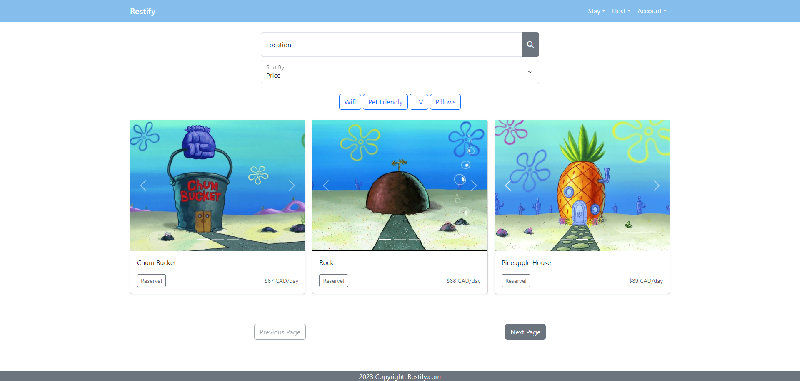
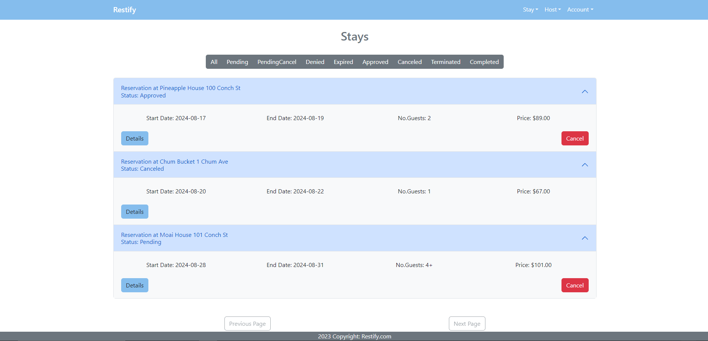
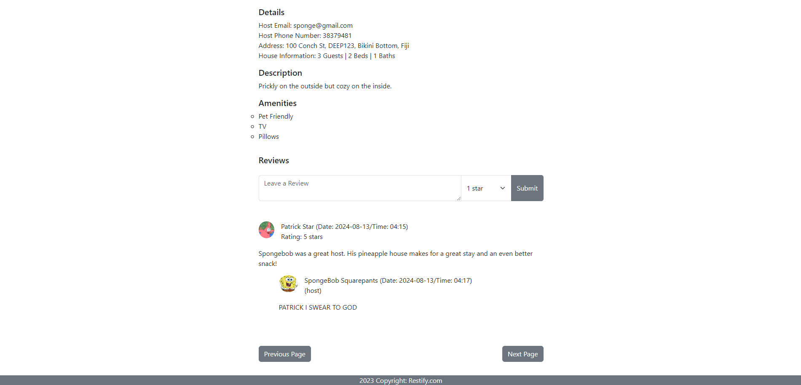

# Restify - CSC309 Final Project
Restify is a platform for reserving and hosting short-term home rentals.

Key Features:
* Browsing and filtering properties.
* Booking properties.
* Hosting your own properties.
* Approve or reject incoming reservations for your property.
* Leave reviews on past hosts and guests. Reply to property reviews.
* Receive notifications.
  
This app is developped with Djanjo (backend) and React (frontend)

